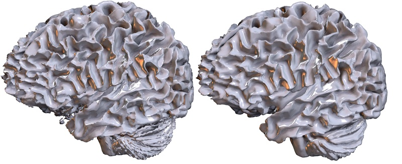
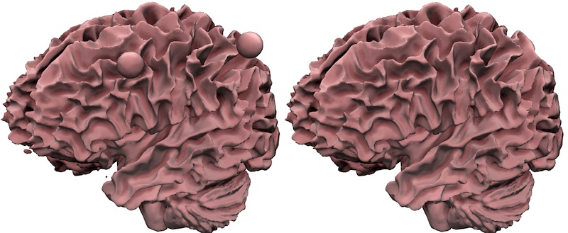
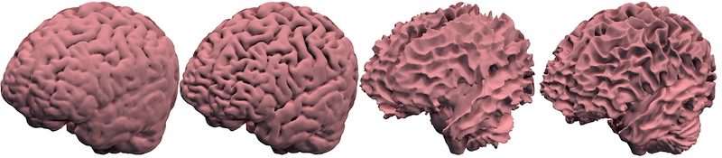
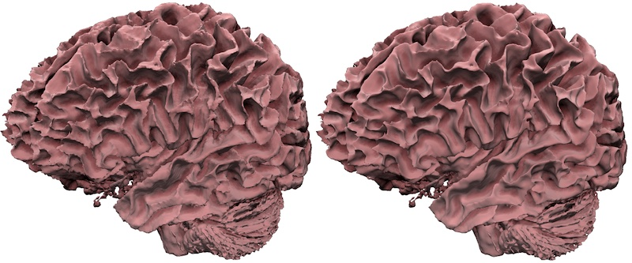
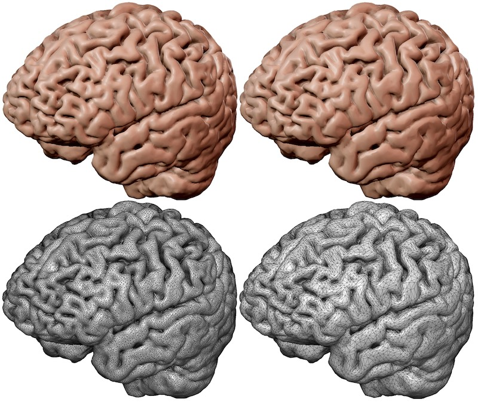

## About

This tool converts a NIfTI 3D voxel image to a triangulated mesh. It can save meshes in in the GIfTI (.gii), mz3, obj, ply, FreeSurfer (.pial), stl, vtk, formats. You can use [dcm2niix](https://github.com/rordenlab/dcm2niix) to convert DICOM images to NIfTI. The software is written in pure C (rather than C++).

## Live Demo

 - The [live demo web page](https://github.com/rordenlab/nii2meshWeb) allows you to use nii2mesh without installing any software on your computer.

## Compiling

For Unix computers (Linux, macOS), you can build the executable using the make command:

```
git clone https://github.com/neurolabusc/nii2mesh
cd nii2mesh/src
make
```

You can also compile the program using Windows, but you may find it easier to download the pre-compiled executable found by selecting the [`Releases`](https://github.com/neurolabusc/nii2mesh/releases/latest/).

You can also specify compile time options to modify the software. Here are some possible optional compiles (though note you can also combine various options simultaneously):

```
make CXX=clang
OMP=1 make
JSON=1 make -j
OLD=1 make
```

If you have both [gcc](https://gcc.gnu.org) and [Clang LLVM](https://clang.llvm.org) compilers installed, you can use `CXX=clang` to explicitly select the Clang compiler. The environment variable `OMP=1` will compile with [OpenMP](https://www.openmp.org) which will use multiple threads to accelerate creation of atlas-based meshes. You can specify `JSON=1` to support saving meshes in [jmesh](https://github.com/OpenJData/jmesh) format. The `OLD=1` will use Cory Bloyd's classic Marching Cubes algorithm instead of Thomas Lewiner's optimized tables (the classic method is faster, but may not handle ambiguous edges as gracefully).

For Windows, it is recommended that you can compile this project by installing the optional [Clang/LLVM ](https://docs.microsoft.com/en-us/cpp/build/clang-support-msbuild?view=msvc-170) available with Visual Studio 2019 version 16.2 and later. The code can be compiled using Clang/LLVM with the command:

```
gcc -DNII2MESH -DHAVE_ZLIB nii2mesh.c MarchingCubes.c isolevel.c meshify.c quadric.c base64.c bwlabel.c radixsort.c -o nii2mesh -lz -lm
```

The project has been tested with [C99](https://en.wikipedia.org/wiki/C99) compilers. The Microsoft C compiler (MSVC) only [conforms](https://docs.microsoft.com/en-us/cpp/c-language/ansi-conformance?view=msvc-170) to [C90](https://en.wikipedia.org/wiki/ANSI_C). In theory, one can compile the project (without zlib support) with the command:

```
cl -DNII2MESH nii2mesh.c MarchingCubes.c isolevel.c meshify.c quadric.c base64.c bwlabel.c radixsort.c
```

## Usage

Here are the instructions for using this tool (you can also run the executable without any arguments to see this help):

```
Converts a NIfTI voxelwise volume to triangulated mesh.
Usage: ./nii2mesh inputNIfTI [options] outputMesh
Options
    -a s    atlas text file (e.g. '-a D99_v2.0_labels_semicolon.txt')
    -b v    bubble fill (0=bubbles included, 1=bubbles filled, default 0)
    -i v    isosurface intensity (d=dark, m=mid, b=bright, number for custom, default medium)
    -l v    only keep largest cluster (0=all, 1=largest, default 1)
    -o v    Original marching cubes (0=Improved Lewiner, 1=Original, default 0)
    -p v    pre-smoothing (0=skip, 1=smooth, default 1)
    -r v    reduction factor (default 0.25)
    -q v    quality (0=fast, 1= balanced, 2=best, default 1)
    -s v    post-smoothing iterations (default 0)
    -v v    verbose (0=silent, 1=verbose, default 0)
mesh extension sets format (.gii, .mz3, .obj, .ply, .pial, .stl, .vtk)
Example: './nii2mesh voxels.nii mesh.obj'
Example: './nii2mesh bet.nii.gz -i 22 myOutput.obj'
Example: './nii2mesh bet.nii.gz -i b bright.obj'
Example: './nii2mesh img.nii -v 1 out.ply'
Example: './nii2mesh img.nii -p 0 -r 1 large.ply'
Example: './nii2mesh img.nii -r 0.1 small.gii'
```
## Processing Steps

The program provides several options to allow you to fine tune the conversion. To illustrate these options, we will show how they influence the included image `bet.nii.gz`. You can use [MRIcroGL](https://www.nitrc.org/plugins/mwiki/index.php/mricrogl:MainPage) to view this voxel-based data. The raw data looks like this:


Specifically, it is a T1 image that has been brain extracted (we have removed the scalp). Note that there is a hollow ball near the left frontal cortex and a solid ball near the right posterior lobe.

In the images below, we will view the resulting meshes using [Surfice](https://www.nitrc.org/plugins/mwiki/index.php/surfice:MainPage). Another good tool for viewing meshes is [MeshLab](https://www.meshlab.net).

1. You can choose to pre-smooth your data (`-p 1`) or not (`-p 0`) prior to making a mesh. This emulates a Gaussian blur with a narrow kernel, which tends to attenuate noise in the image. 

```
nii2mesh bet.nii.gz -p 0  p0.ply
nii2mesh bet.nii.gz -p 1 p1.ply
```



2. You can choose to only retain the largest connected object (`-l 1`) or keep all objects (`-l 0`). The image below shows that the balls and other small blobs do not appear when `-l 1` is selected.

```
nii2mesh bet.nii.gz -l 0 l0.ply
nii2mesh bet.nii.gz -l 1 l1.ply
```



3. You can choose to fill bubbles (`-b 1`) or retain bubbles (`-b 0`). Filling holes will create solid objects if you print them. If you look at the cut-away views below you will notice that this option determines whether the ventricles inside the brain and the interior sphere exist in the mesh file.

```
nii2mesh bet.nii.gz -i 122 -l 0 -b 0 b0.ply
nii2mesh bet.nii.gz -i 122 -l 0 -b 1 b1.ply
```


4. You can choose an isosurface value. This is the voxel brightness used to distinguish air from tissue. If you click on the voxel data with MRIcroGL, you will note that the brightness of the selected voxel location is shown in the title bar, allowing you to estimate a good boundary. The options `-i d`, `-i m`, `-i b` choose dark, medium and bright values based on [multi-Otsu thresholding](https://scikit-image.org/docs/stable/auto_examples/segmentation/plot_multiotsu.html). You can also specify an explicit numeric value, for example `-i 128`. If you do not specify a value, the program will default to the medium intensity.

```
nii2mesh bet.nii.gz -i d d.ply
nii2mesh bet.nii.gz -i m m.ply
nii2mesh bet.nii.gz -i b b.ply
nii2mesh bet.nii.gz -i 122 122.ply
```



5. The `-s` option allows you to specify the number of iterations for the [smoothing of your mesh](https://doi.org/10.1111/1467-8659.00334). Unlike the `p`re-smooth, the `s`mooth is applied after the voxels are converted into a triangular mesh. This effect is much more subtle than the pre-smooth. This option is best suited for low resolution, block images. It is worth noting that the reduction factor also will tend to smooth images, attenuating small variations. Therefore, to illustrate the effect we are turning off both the pre-smoothing and the mesh reduction.

```
nii2mesh bet.nii.gz -i 120 -r 1 -p 0 -s 0 s0.ply
nii2mesh bet.nii.gz -i 120 -r 1 -p 0 -s 100 s100.ply
```



6. The reduction factor allows you to simplify the mesh, resulting in a much smaller file size and faster rendering on slow hardware. This stage uses [Sven Forstmann's](https://github.com/sp4cerat/Fast-Quadric-Mesh-Simplification) simplification method which is [adaptive](http://www.alecjacobson.com/weblog/?p=4444), using smaller triangles in regions of curvature and large triangles in flat regions. Choosing a value of `-r 0.15` will eliminate 85% of the triangles. Notice how similar the top row appears, while the bottom row illustrates a dramatic reduction in complexity.

```
nii2mesh bet.nii.gz -r 0.5 r50.ply
nii2mesh bet.nii.gz -r 0.15 r15.ply 
```



## Atlases

Atlases identify different discrete brain regions, such as [Brodmann Area](https://en.wikipedia.org/wiki/Brodmann_area). Most NIfTI atlases store each voxel intensity as an integer, identifying the region. Here, we consider this [example dataset](https://afni.nimh.nih.gov/pub/dist/doc/htmldoc/nonhuman/macaque_tempatl/atlas_d99v2.html). The nii2mesh `-a 1` argument is similar to the AFNI isosurface [`-isorois`](https://afni.nimh.nih.gov/pub/dist/doc/program_help/IsoSurface.html) option, to create an isosurface for each unique value in the input volume. 

The simplest usage would be:

```
nii2mesh D99_atlas_v2.0_right.nii.gz -a 1 D99.gii
```

Note that the presmooth may slightly erode very small or thin regions. If this is undesirable, you could turn off the pre-smoothing and consider applying a small amount of smoothing after the mesh is created:

```
nii2mesh D99_atlas_v2.0_right.nii.gz -p 0 -s 10 -a 1 D99s10roi.mz3
```

Alternatively, you can provide the file name for a semicolon delimited text file. The format should have the index number in the first column, and the nickname in the second column. Consider the provided example file `D99_v2.0_labels_semicolon.txt`:

```
1;pu;putamen;Basal ganglia;Striatum
2;cd;caudate nucleus;Basal ganglia;Striatum
3;NA;nucleus accumbens;Basal ganglia;Striatum_ventral striatum
...
```

We could use this with the command:

```
nii2mesh D99_atlas_v2.0_right.nii.gz -a D99_v2.0_labels_semicolon.txt D99_.gii
```

with the resulting meshes have the file names `D99_pu.k1.gii`, `D99_cd.k2.gii`, etc.


## Supported Mesh Formats

nii2mesh can save meshes to the GIfTI (.gii), json, jmsh, mz3, obj, off, ply, FreeSurfer (.pial), stl, vtk.  [MeshLab](https://www.meshlab.net) can export meshes to many other formats. Therefore, one option is to create a PLY mesh with nii2mesh and use MeshLab to export to your favorite format.

 - [GIfTI](https://www.nitrc.org/projects/gifti/) is a popular Geometry format for Neuroimaging. The usage of base64 encoding leads to relatively large files and slow loading.
 - [OBJ](http://www.paulbourke.net/dataformats/obj/) format is very popular, and may be a great choice for 3D printing. The use of ASCII rather than binary encoding makes these files large, slow to read and typically suggests limited precision.
 - [OFF](https://en.wikipedia.org/wiki/OFF_(file_format)) is a classic ASCII format.
 - [PLY](http://paulbourke.net/dataformats/ply/) is an old format that is widely supported. The binary form created by nii2mesh yields small files and quick loading time.
 - [MZ3](https://github.com/neurolabusc/surf-ice/tree/master/mz3) is the native format of [Surfice](https://www.nitrc.org/projects/surfice/). It is small and fast, but not widely supported.
 - [FreeSurfer](https://surfer.nmr.mgh.harvard.edu) format is simple and used by FreeSurfer.
 - [json](https://github.com/fangq/jmesh) creates human readable ASCII JSON files in the format described by [jmesh](https://github.com/fangq/jmesh). Be aware that other tools create legal JSON files to describe triangular meshes using a structure that is not compatible with json.
 - [jmsh](https://github.com/fangq/jmesh) files are in the [jmesh](https://github.com/fangq/jmesh) format, which inserts a compressed binary stream into a human readable JSON file. Supporting this format slightly increases the size of the executable (using the optional `-DHAVE_JSON` compiler flag and `cJSON` files).
 - [VTK](http://www.princeton.edu/~efeibush/viscourse/vtk.pdf) refers to the legacy VTK format, which is supported by many tools (unlike the more flexible modern XML-based VTK formats).
 - [STL](http://www.paulbourke.net/dataformats/stl/) format is popular for 3D printing. You should use any other format unless required. This format does not re-use vertices across triangles, this results in very large files. Further, this means the meshes are either slow to load or appear to have a faceted jagged appearance.

## Printing

You can use this tool to generate meshes suitable for 3D printing.

1. If your MRI is in DICOM format, convert it to NIfTI with [dcm2niix](https://github.com/rordenlab/dcm2niix).
2. Brain extract your image. You could use [SSwarper](https://afni.nimh.nih.gov/pub/dist/doc/program_help/@SSwarper.html), [3dSkullStrip](https://afni.nimh.nih.gov/pub/dist/doc/program_help/3dSkullStrip.html), [BET](https://fsl.fmrib.ox.ac.uk/fsl/fslwiki/BET/UserGuide), [FAST](https://fsl.fmrib.ox.ac.uk/fsl/fslwiki/FAST) or [HD-BET](https://github.com/MIC-DKFZ/HD-BET) for this step.
3. Apply nii2mesh to generate a mesh you can print locally or using a service like [Shapeways](https://www.shapeways.com) or [Kraftwurx](http://www.kraftwurx.com)

nii2mesh is a general mesh making method, which can be applied to any NIfTI image: a MRI or CT scan of any region of the body, a high-quality scan of any object including the animals of [DigiMorph](http://digimorph.org/index.phtml), [phenome10k](https://www.phenome10k.org), [MorphoSource](https://www.morphosource.org), the [NIH 3D Print Exchange](https://3dprint.nih.gov) or [other 3D databases](https://morphomuseum.com/links).

For brain specific printing, you may want to look at these tutorials.

 - [nii\_nii2stl](https://github.com/rordenlab/spmScripts/blob/master/nii_nii2stl.m) uses Matlab and SPM.
 - [Fei Gu](https://flashsherlock.github.io/2021/10/23/how-to-print-your-brain/) uses FreeSurfer, MeshLab and Meshmixer.
 - [Michael Notter](https://github.com/miykael/3dprintyourbrain) uses FreeSurfer and MeshLab.
 - This [Instructables](https://www.instructables.com/3D-print-your-own-brain/) tutorial uses FreeSurfer and MeshLab.
 - [Mohan Gupta](https://www.mohanwugupta.com/post/3d_brain_printing/) uses FreeSurfer and MeshLab.
 - [Ford Burles](https://fordburles.com/3d-print-brain-guide.html) uses FreeSurfer and MeshLab or Blender.
 
## Limitations

Similar to most mesh tools, nii2mesh uses fast algorithms that can generate self intersecting triangles. If you are conducting analyses where this is undesirable (e.g boundary element method (BEM) and finite element method (FEM) computations) you should consider (slower) algorithms that prevent these [features](https://journals.plos.org/plosone/article?id=10.1371/journal.pone.0184206). If you are interested in these applications, you may want to consider [iso2mesh](http://iso2mesh.sourceforge.net/cgi-bin/index.cgi).

If you generate meshes that are only a single object (`-l 1`) that is watertight (e.g. bubble-filled, `-b 1`) you can fix self intersections with [MeshFix](https://github.com/MarcoAttene/MeshFix-V2.1):

```
nii2mesh bet.nii.gz -b 1 -l 1 bet.ply
MeshFix bet.ply better.ply
```

## Links

 - By default, this project uses an [enhanced Marching Cubes algorithm](http://thomas.lewiner.org/pdfs/marching_cubes_jgt.pdf) to convert voxels to a triangular mesh. Optionally, it can be compiled to use the (faster) classic marching cubes [method implemented by Cory Bloyd](http://paulbourke.net/geometry/polygonise/).
 - This project includes a C port of [Sven Forstmann's C++ fast mesh simplification](https://github.com/sp4cerat/Fast-Quadric-Mesh-Simplification) using [quadric error metrics](http://www.cs.cmu.edu/~./garland/Papers/quadric2.pdf).
 - For post-smoothing, this project uses a [Laplacian smooth with Humphrey’s Classes to preserve volume](https://doi.org/10.1111/1467-8659.00334), also available as a [PDF](http://informatikbuero.com/downloads/Improved_Laplacian_Smoothing_of_Noisy_Surface_Meshes.pdf).
 - AFNI [IsoSurface](https://afni.nimh.nih.gov/pub/dist/doc/program_help/IsoSurface.html) can also convert voxelwise data to meshes.
 - [Alec Jacobson has a nice demonstration of adaptive mesh simplification versus decimation](http://www.alecjacobson.com/weblog/?p=4444).
 - [Alec Jacobson](https://github.com/alecjacobson/geometry-processing-smoothing) describes smoothing and provides example noisy meshes.
 - MRtrix3 includes [voxel2mesh](https://mrtrix.readthedocs.io/en/latest/reference/commands/voxel2mesh.html)
 - [iso2mesh](http://iso2mesh.sourceforge.net/cgi-bin/index.cgi) provides a set of Matlab/Octave methods for mesh generation and refinement ([with more details on GitHub](https://github.com/fangq/iso2mesh)).
 - FSL [FIRST](https://fsl.fmrib.ox.ac.uk/fsl/fslwiki/FIRST/UserGuide) automates tissue segmentation and can generate VTK format meshes.
 - [nii\_2\_mesh\_conversion.py](https://github.com/MahsaShk/MeshProcessing) is related to nii2mesh: it converts a binary NIfTI image to a mesh in STL format using VTK the package.
  - [DicomToMesh](https://github.com/AOT-AG/DicomToMesh) is available for Debian-based Linux.
 - [Online tool for NIfTI to STL conversion](http://niftyweb.cs.ucl.ac.uk/program.php?p=PRINTING).
 - [Comparison of voxel to mesh conversion tools](https://threedmedprint.biomedcentral.com/articles/10.1186/s41205-020-00069-2).